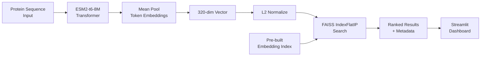

# BioInsights AI

> Protein similarity search platform that encodes FDA-approved biologic sequences with Meta's ESM2 language model and retrieves nearest neighbors via FAISS — returning cosine similarity scores in milliseconds.

**Built with:** Python, ESM2 (Meta AI), FAISS, Streamlit, Plotly, PyTorch, Pandas

---

## The Problem

Drug discovery teams and researchers frequently need to assess how similar a candidate therapeutic protein is to existing FDA-approved biologics — for novelty assessment, freedom-to-operate analysis, or identifying structurally related drugs to study. Running this comparison manually against literature or patent databases is time-consuming and requires deep bioinformatics expertise. Most tools that do this require expensive subscriptions or return results based on sequence alignment alone, which misses functional similarity that language models can capture.

---

## What I Built

BioInsights AI takes a protein amino acid sequence, generates a fixed-length embedding using Meta's ESM2 transformer model, and finds the most similar proteins in a pre-indexed database of FDA-approved biologics using FAISS vector search. The result is a ranked list of similar drugs with cosine similarity scores, chain type, and therapeutic area — surfaced through an interactive Streamlit dashboard.

- **ESM2 Embedding Generator** (`src/embedding_generator.py`): Loads ESM2-t6-8M, processes protein sequences through the transformer, and mean-pools the final layer token representations into 320-dimensional vectors.
- **FAISS Search Engine** (`src/similarity_search.py`): Builds an `IndexFlatIP` index over L2-normalized embeddings. Supports three query modes: raw sequence, pre-computed embedding array, or protein ID lookup from the database. Filters by chain type (heavy/light) and therapeutic area.
- **Data Pipeline** (`src/data_collector.py`, `src/expand_dataset.py`, `src/fix_metadata.py`): Collects antibody sequences for biologics including Adalimumab, Trastuzumab, Rituximab, Bevacizumab, Pembrolizumab, Nivolumab, and Infliximab. Classifies each by therapeutic area (Oncology, Autoimmune) and separates heavy from light chains.
- **Streamlit Dashboard** (`app.py`): Four-tab interface — similarity search with input validation, database analytics with Plotly charts, a filterable/downloadable protein browser, and a technical about page. ESM2 is loaded lazily to avoid startup latency.

---

## Key Technical Decisions

**Why `IndexFlatIP` instead of approximate search (IVF, HNSW)?**
Exact inner product search has no recall tradeoff, and at the current database scale the index fits entirely in memory with sub-millisecond query time. Approximate indexes introduce quantization error and a training step that is only worthwhile at tens of thousands of vectors or more. The exact index is simpler to maintain and guarantees correct ranking.

**Why mean-pool the final transformer layer instead of using the `[CLS]` token?**
ESM2's `[CLS]` token is not supervised for classification in the same way BERT variants are — it does not accumulate sequence-level context as reliably. Mean-pooling over non-special tokens produces a representation that integrates information from every residue position, which is the standard in protein language model literature for sequence-level similarity tasks.

**Why lazy ESM2 loading (`load_esm2=False` by default)?**
The model weights load in several seconds and consume significant memory. For the common use case — searching against pre-computed embeddings from the database — there is no reason to pay that cost on startup. The model is only initialized when a user submits a novel sequence that does not already exist in the index, keeping the dashboard responsive for the majority of queries.

**Why Streamlit instead of a FastAPI + React split?**
This is a research and exploration tool, not a production API. Streamlit collocates the data logic and the UI in a single Python process, which eliminates a network boundary, removes the need for serialization contracts, and allows the `@st.cache_resource` decorator to hold the FAISS index in process memory across requests — avoiding repeated index reconstruction.

---

## Results & Metrics

- 320-dimensional ESM2 embeddings → exact cosine similarity scores via FAISS `IndexFlatIP`
- Sub-millisecond FAISS query time for the indexed protein set
- 7 FDA-approved biologics (Adalimumab, Trastuzumab, Rituximab, Bevacizumab, Pembrolizumab, Nivolumab, Infliximab) with heavy and light chains indexed separately
- Therapeutic area classification (Oncology vs. Autoimmune) derived programmatically from indication text
- Replaces manual BLAST or literature searches that require bioinformatics toolchain setup and return alignment-only results without functional similarity signals

---

## Architecture



---

## Stack

| Layer | Technology |
|---|---|
| Protein Language Model | Meta ESM2-t6-8M (8M parameters, 320-dim embeddings) |
| Vector Search | FAISS `IndexFlatIP` (exact cosine similarity) |
| Deep Learning Runtime | PyTorch (CPU inference) |
| Frontend / UI | Streamlit |
| Visualizations | Plotly (bar charts, pie charts, scatter) |
| Data Layer | Pandas, Pickle |
| Sequence I/O | Biopython |

---

## Setup

**Prerequisites:** Python 3.9+, pip

```bash
pip install streamlit plotly pandas numpy torch fair-esm faiss-cpu biopython tqdm

# Generate embeddings (one-time, requires ESM2 model download)
python src/data_collector.py
python src/expand_dataset.py
python src/embedding_generator.py
python src/fix_metadata.py

# Launch the dashboard
streamlit run app.py
```

No `.env` file required — the application uses only local files and no external APIs at runtime.

---

## Where This Fits

Biologics drug development moves from target identification through lead optimization, preclinical, and IND filing before entering clinical trials. This tool addresses the lead optimization and novelty assessment stage, where teams need to understand the competitive landscape and structural space around a candidate molecule.

```
Target ID → Lead Discovery → [Lead Optimization / Novelty Assessment ↑] → Preclinical → IND → Clinical
```

---

## Production Considerations

- **Embedding coverage**: The current index covers 7 reference biologics. A production deployment would ingest full DrugBank or ChEMBL biologic sequence exports, scaling to thousands of entries. FAISS approximate indexes (IVF or HNSW) become relevant at that scale.
- **Model quality vs. speed**: `esm2_t6_8M_UR50D` (320-dim) is optimized for fast inference. The `esm2_t33_650M_UR50D` variant (1280-dim, 650M parameters) produces richer embeddings and would improve similarity precision for subtle structural differences in antibody CDR regions.
- **New sequence embedding at inference time**: The current UI falls back to database lookup when ESM2 is not loaded. A production path needs a background worker or async inference service to embed novel sequences without blocking the request thread.
- **Data provenance**: Sequences are manually curated from public databases. A production system should track DrugBank version, UniProt accession, and sequence revision history alongside each embedding to ensure reproducibility.
- **Regulatory context**: Similarity scores should be accompanied by sequence alignment (e.g., via Biopython pairwise2) to satisfy patent freedom-to-operate workflows, which require both AI-derived and alignment-based evidence.
